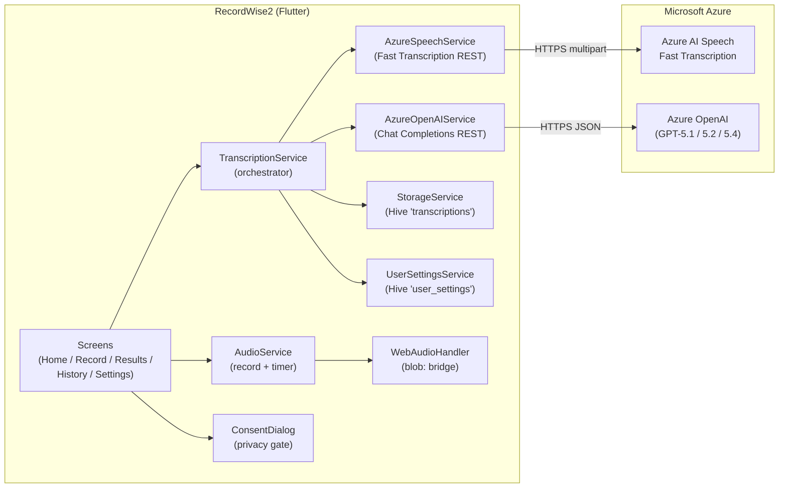
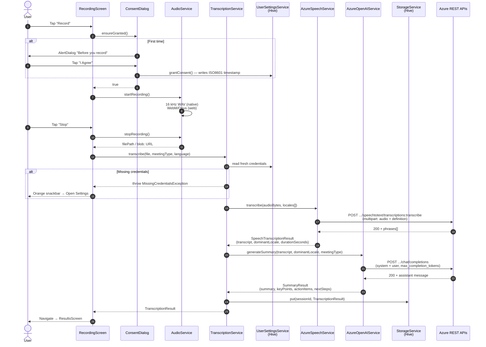
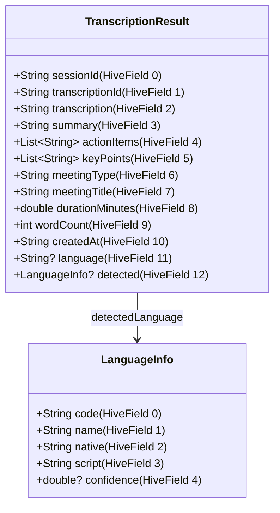
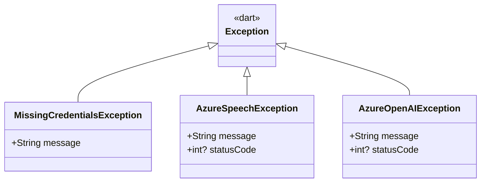
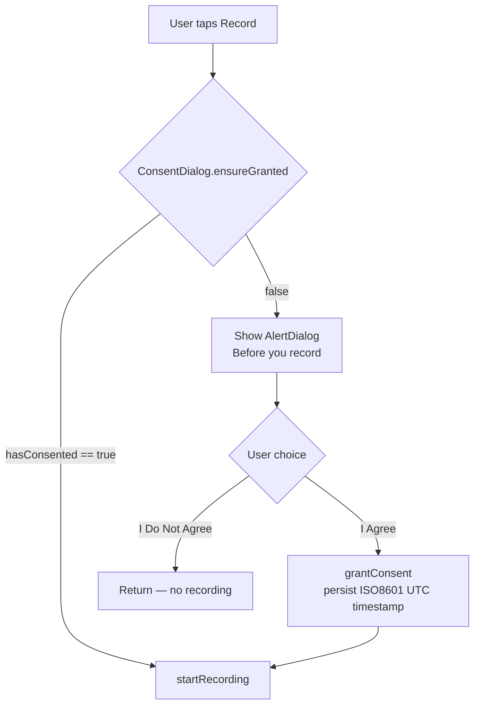
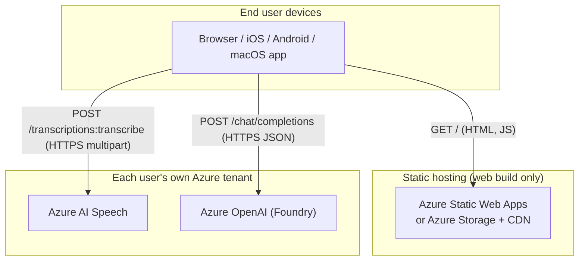

# RecordWise2 — Technical Reference

> A cross-platform Flutter client (**Web · iOS · Android · macOS**) that
> talks **directly** to Microsoft Azure AI services — no backend, no
> middleware, no glue server. This document is the *technical*
> companion to the project: how it is structured, what trade-offs were
> made, where the non-obvious bugs live, and how to reuse the pieces in
> your own work.
>
> If you just want to *run* the app, see the short [README](README.md).
> This file is for engineers who plan to fork, adapt, or learn from it.

---

## Table of Contents

1. [Project Goal & Scope](#1-project-goal--scope)
2. [System Architecture](#2-system-architecture)
3. [Pipeline — request lifecycle](#3-pipeline--request-lifecycle)
4. [Module-by-module walkthrough](#4-module-by-module-walkthrough)
5. [Cross-platform strategy](#5-cross-platform-strategy)
6. [State management & persistence](#6-state-management--persistence)
7. [Azure integration deep-dive](#7-azure-integration-deep-dive)
8. [Language detection & script handling](#8-language-detection--script-handling)
9. [Error model & graceful degradation](#9-error-model--graceful-degradation)
10. [Privacy & consent flow](#10-privacy--consent-flow)
11. [Build matrix & release configuration](#11-build-matrix--release-configuration)
12. [Hosting topology](#12-hosting-topology)
13. [Design trade-offs (and what we did NOT build)](#13-design-trade-offs-and-what-we-did-not-build)
14. [Security model & roadmap](#14-security-model--roadmap)
15. [Extending the app](#15-extending-the-app)
16. [License](#16-license)

---

## 1. Project Goal & Scope

### The question this project answers

> **"What is the cleanest way to combine [Azure AI Speech Fast
> Transcription](https://learn.microsoft.com/en-us/azure/ai-services/speech-service/fast-transcription-create)
> (with speaker diarization + multi-locale language ID) and the GPT-5
> family on [Azure OpenAI / Microsoft Foundry](https://ai.azure.com),
> from a single Flutter codebase that runs everywhere?"**

RecordWise2 is the reference answer. The deliberate constraints:

| Constraint | Why |
|---|---|
| **One codebase, four targets** (Web, iOS, Android, macOS) | Show how far modern Flutter goes without per-platform forks. |
| **No backend, no middleware, no proxy** | Every Azure call originates from the device. The bill of materials is just *device → Azure*. |
| **No SDK lock-in** — plain `dio` over REST | Anyone can port the integration to another HTTP client, another language, or curl. |
| **Bring-Your-Own-Azure** | Reviewers, students, and forkers can stand up the app against their own Azure tenant in minutes. |
| **All credentials on-device** (Hive) | No shared secret, no per-user account system, no auth backend. |
| **Reasoning-aware GPT-5 calling pattern** | Use `max_completion_tokens` (not `max_tokens`), let the model own `temperature`. |
| **Hard cap at 2 h / 500 MB** | Matches Azure Fast Transcription limits — same as Microsoft's documented ceiling. |

### What it is NOT

- Not a multi-tenant SaaS. There is no account system, no per-user quota, no shared storage.
- Not a low-latency *streaming* transcription app. It uses the synchronous Fast Transcription REST endpoint, not the WebSocket continuous-recognition API.
- Not a meeting bot. It captures the microphone on the device that runs it; it does not join calls.
- Not production-hardened. See [§14 Security model & roadmap](#14-security-model--roadmap) for the parked items.

---

## 2. System Architecture

### 2.1 Component view



Two layers, two boundaries — the smallest viable shape for an Azure-AI
demo.

### 2.2 Source tree

```
recordwise2/
├── lib/
│   ├── main.dart                          # Hive init, Provider tree, MaterialApp
│   ├── models/
│   │   ├── transcription_models.dart      # Hive @HiveType data classes
│   │   └── transcription_models.g.dart    # build_runner-generated adapters
│   ├── screens/
│   │   ├── home_screen.dart               # Tab shell + recent sessions
│   │   ├── recording_screen.dart          # Capture → consent gate → transcribe
│   │   ├── results_screen.dart            # Transcript + AI summary
│   │   ├── results_history_screen.dart    # Hive-backed list
│   │   └── settings_screen.dart           # BYO Azure credentials + privacy
│   ├── services/
│   │   ├── azure_speech_service.dart      # ★ Fast Transcription REST client
│   │   ├── azure_openai_service.dart      # ★ Chat Completions REST client
│   │   ├── transcription_service.dart     # ★ End-to-end orchestrator
│   │   ├── audio_service.dart             # Microphone capture (ChangeNotifier)
│   │   ├── storage_service.dart           # Hive box: 'transcriptions'
│   │   ├── user_settings_service.dart     # Hive box: 'user_settings'
│   │   ├── web_audio_handler.dart         # Conditional-import shell
│   │   ├── web_audio_handler_io.dart      # Native no-op stub
│   │   └── web_audio_handler_web.dart     # Browser blob: bridge
│   ├── widgets/
│   │   ├── consent_dialog.dart            # Pre-flight Microsoft Azure disclosure
│   │   └── file_upload_widget*.dart       # Conditional-import file picker
│   └── utils/
│       └── constants.dart                 # App-wide caps + defaults
├── android/  ios/  macos/  web/           # Platform shells
└── pubspec.yaml
```

The three **starred files** are the entire Azure integration surface.
If you are reading the code as a sample, start there — together they
are under 1,100 lines.

### 2.3 Why no backend

The original [RecordWise](https://github.com/easonlai/RecordWise)
shipped a FastAPI backend that performed:

| Backend responsibility | Where it lives now |
|---|---|
| Multipart proxy to Azure Speech | `AzureSpeechService.transcribe()` |
| GPT prompt assembly + Chat Completions call | `AzureOpenAIService.generateSummary()` |
| Diarization grouping | `AzureSpeechService._collapseBySpeaker()` |
| Dominant-locale calculation | Same file, `_dominantLocale()` |
| OpenCC `s2t` script normalisation for `zh-HK` | **Removed** — handled inside the LLM prompt instead (§8) |
| ffmpeg-based WAV normalisation | **Removed** — raw browser/device audio sent as-is |
| Per-user credential storage | `UserSettingsService` (Hive on-device) |
| Persistent transcript storage | `StorageService` (Hive on-device) |

Removing the backend removed:

- The deployment surface (Container Apps / App Service / etc.).
- A shared CORS surface, a shared `API_TOKEN`, server-side temp files.
- A whole class of bugs (multipart proxying, audio re-encoding,
  Python-only OpenCC dependency).

It also removed the only place where things like rate-limiting and
prompt-injection mitigation could live centrally. Those are now
*per-device* concerns and remain parked — see [§14](#14-security-model--roadmap).

---

## 3. Pipeline — request lifecycle

### 3.1 End-to-end sequence



### 3.2 Concurrency model

Flutter runs all Dart code on a single event-loop isolate. The pipeline
is **fully `async`** — every step yields to the event loop, and the UI
keeps rebuilding `ChangeNotifier` listeners. No `Isolate.spawn`, no
`compute()`. Two reasons:

- The CPU work (parsing JSON, walking the `phrases[]` array) is
  millisecond-scale relative to the network calls (seconds).
- Hive's standard adapter is non-async-safe across isolates — using it
  from another isolate requires `IsolatedBox`, which adds complexity
  this app doesn't need.

If you adapt this for *long* CPU work (e.g. running a local FFmpeg
pass before upload), wrap that step in `compute()`.

### 3.3 Timeouts & retries

| Stage | Timeout | Retry |
|---|---|---|
| Audio capture | Hard cap: `AppConstants.maxRecordingMinutes = 120` (2 h), auto-stop in `AudioService` | n/a |
| Azure Speech POST | `dio.connectTimeout = 30 s`, `receiveTimeout = 300 s` (5 min for 2 h audio) | None — first failure surfaces to user |
| Azure OpenAI POST | `connectTimeout = 30 s`, `receiveTimeout = 120 s` | None |
| Hive read/write | Synchronous on the calling isolate | n/a |

There is **no retry loop** on Azure failures — by design. A 401 means
wrong key; retrying with the same key is pointless. A 429 means quota;
the user should wait and resubmit. Both cases are surfaced via a typed
exception (§9), and the audio is **never lost** because step 5 of the
sequence diagram (persist to Hive) is reached even when summarisation
fails.

---

## 4. Module-by-module walkthrough

### 4.1 `TranscriptionService` — the orchestrator

[`lib/services/transcription_service.dart`](lib/services/transcription_service.dart) (~290 LOC)

This is the file the original FastAPI route handler turned into. It owns:

- **Credential validation** — pulls a fresh snapshot from
  `UserSettingsService` on every call, throws `MissingCredentialsException`
  when anything is missing. There is no "best-effort partial run" mode.
- **Audio source unification** — collapses the web `blob:` URL path and
  the native `dart:io File` path into a single `Uint8List + fileName`
  shape before calling Azure Speech.
- **Language metadata** — given the dominant locale from Azure (e.g.
  `zh-HK`), it produces a `LanguageInfo` record (name, native name,
  script) that gets persisted alongside the transcript.
- **Hive write** — final step is a synchronous `box.put(sessionId,
  result)`. The session id is the millisecond timestamp at the start of
  the run.

The orchestrator deliberately exposes the *same three methods* (`transcribe`,
`transcribeWithAudioData`, `transcribeUploadedFile`) the original
`ApiService` did, so the recording screen needed only an import swap
during the backend removal.

### 4.2 `AzureSpeechService` — Fast Transcription client

[`lib/services/azure_speech_service.dart`](lib/services/azure_speech_service.dart) (~350 LOC)

- Pure `dio` REST client.
- Endpoint: `POST {region}.api.cognitive.microsoft.com/speechtotext/transcriptions:transcribe?api-version=2024-11-15`
  (override-able from Settings; sovereign clouds via custom endpoint).
- Auth: `Ocp-Apim-Subscription-Key` header.
- Two **critical multipart rules** documented in the file header:
  1. `audio` part must come **before** `definition`. Reverse the order
     and Azure happily returns `200 OK` with an empty `phrases[]`.
  2. The `definition` part must be `MultipartFile.fromString(...)` —
     **no filename**, **no `application/octet-stream` content type**.
     If you accidentally send it as a binary file, Azure stalls ~8 s
     then returns a misleading `429 Resource Exhausted`.
- Post-processing:
  - `_collapseBySpeaker(phrases)` groups consecutive phrases by
    `speaker` field, joins their text, and emits `Speaker 1: …\nSpeaker
    2: …` blocks. Single-speaker output omits the prefix.
  - `_dominantLocale(phrases)` does a `Map<String,int>` count of
    per-phrase locales, picks the highest (ties → first occurrence).
  - `_totalDurationSeconds(phrases)` sums `durationMilliseconds`.

### 4.3 `AzureOpenAIService` — Chat Completions client

[`lib/services/azure_openai_service.dart`](lib/services/azure_openai_service.dart) (~385 LOC)

- Endpoint: `POST {endpoint}/openai/deployments/{deployment}/chat/completions?api-version=2024-12-01-preview`.
- **`max_completion_tokens`, not `max_tokens`** — GPT-5 reasoning models
  reject the legacy parameter with HTTP 400 "Unsupported parameter".
- **No custom `temperature`** — GPT-5 only honours the default `1`.
  Omitting it keeps the same code working against both GPT-4o-class and
  GPT-5 reasoning deployments.
- `_systemPrompt(dominantLocale, meetingType)` generates a
  language-aware system prompt with three branches:

  | Dominant locale | Prompt body | Headings |
  |---|---|---|
  | `zh-HK` / `zh-TW` | Traditional Chinese | `## 執行摘要`, `## 主要討論要點`, `## 行動項目`, `## 下一步` |
  | `zh-CN` / `zh-*` (else) | Simplified Chinese | `## 执行摘要`, `## 主要讨论要点`, `## 行动项目`, `## 下一步` |
  | anything else | English | `## Executive Summary`, `## Key Discussion Points`, `## Action Items`, `## Next Steps` |
- `_parseMarkdown(content)` slices the response on those exact headings
  into `summary`, `keyPoints[]`, `actionItems[]`, `nextSteps[]`.
- Prompt-injection is **not** mitigated — see [§14.2](#142-reduce-prompt-injection-surface).

### 4.4 `AudioService` — microphone capture

[`lib/services/audio_service.dart`](lib/services/audio_service.dart) (~200 LOC)

- `ChangeNotifier`. The recording screen `context.watch()`-es it for
  `isRecording`, `duration`, `seconds`, `isNearTimeLimit`, etc.
- Backed by [`package:record`](https://pub.dev/packages/record) on both
  native and web.
- Native config: `AudioEncoder.wav`, `sampleRate: 16000`, `bitRate: 128000`.
  16 kHz mono is the sweet spot for Azure Speech (downsampling on the
  device beats sending 48 kHz over the network).
- Web config: same `RecordConfig` is passed, but the browser
  MediaRecorder API picks its own native container (WebM/Opus
  typically). Azure transcodes server-side, so this Just Works.
- **Auto-stop at 120 min** — `Timer.periodic` increments a counter;
  reaching `maxRecordingSeconds` fires `onTimeLimitReached(path)`
  which the recording screen wires to the transcription pipeline.
- **5-minute warning band** — `isNearTimeLimit` flips to `true` at
  `(max - 300) s`; the UI uses it to colour the timer red.

### 4.5 `StorageService` — Hive `transcriptions` box

[`lib/services/storage_service.dart`](lib/services/storage_service.dart) (~30 LOC)

The thinnest service in the codebase. Opens the `transcriptions` Hive
box on `initialize()`, exposes typed `put`, `get`, `delete`, `values`,
and a `clear()`. All of `TranscriptionResult` is serialised by the
auto-generated `TranscriptionResultAdapter` (typeId `0`) and
`LanguageInfoAdapter` (typeId `1`) — see `transcription_models.g.dart`.

### 4.6 `UserSettingsService` — Hive `user_settings` box

[`lib/services/user_settings_service.dart`](lib/services/user_settings_service.dart) (~250 LOC)

`ChangeNotifier`. Persists three concern groups:

| Group | Hive keys |
|---|---|
| Azure OpenAI (chat / summary) | `realtime_endpoint`, `realtime_api_key`, `realtime_deployment`, `model_api_version` |
| Azure AI Speech | `speech_key`, `speech_region`, `speech_endpoint`, `speech_api_version`, `speech_max_speakers` |
| Privacy consent | `azure_data_sharing_consent_at` (ISO-8601 UTC) |

> ℹ️ The OpenAI keys retain the legacy `realtime_*` prefix for
> backwards compatibility with on-device data from earlier builds —
> they are semantically the *chat/summary* model credentials now, not
> realtime audio.

`UserSettingsService.notifyListeners()` is called after every save —
the Settings screen re-renders the green/grey "Active" badges; the
recording screen re-renders the orange "Open Settings" snackbar.

---

## 5. Cross-platform strategy

### 5.1 Conditional imports — the web/native facade

Dart's conditional-import pattern lets a single import line resolve to
*different* implementations depending on the target. RecordWise2 uses
it for two facades:

```dart
// lib/services/web_audio_handler.dart
export 'web_audio_handler_io.dart'
    if (dart.library.html) 'web_audio_handler_web.dart';
```

| Target | `dart.library.html` available? | Resolves to |
|---|---|---|
| Web (Chrome / Safari / Firefox / Edge) | ✅ | `web_audio_handler_web.dart` |
| iOS / Android / macOS / Windows / Linux | ❌ | `web_audio_handler_io.dart` (no-op stub) |

The same trick is used for the file-upload widget:

```dart
// lib/widgets/file_upload_widget.dart
export 'file_upload_widget_io.dart'
    if (dart.library.html) 'file_upload_widget_web.dart';
```

Callers always write `import '.../web_audio_handler.dart';` — no
`if (kIsWeb)` switch at the call site.

### 5.2 Web audio bridge

[`lib/services/web_audio_handler_web.dart`](lib/services/web_audio_handler_web.dart) uses
[`package:web`](https://pub.dev/packages/web) +
[`dart:js_interop`](https://api.dart.dev/dart-js_interop/) (the modern
replacement for `dart:html`) to convert a browser `blob:` URL produced
by `MediaRecorder` into a `Uint8List` the dio multipart upload can
consume:

```dart
static Future<Uint8List?> fetchBlobData(String blobUrl) async {
  final response = await window.fetch(blobUrl.toJS).toDart;
  final arrayBuffer = await response.arrayBuffer().toDart;
  return arrayBuffer.toDart.asUint8List();
}
```

The native stub is a 5-line no-op that returns `null` — the native
path goes through `dart:io File` instead and never enters this branch.

### 5.3 Platform-specific bundling

| Platform | Audio engine | File picker | Storage |
|---|---|---|---|
| Web | MediaRecorder (via `record`) → WebM/Opus blob | Browser file `<input>` | Hive on IndexedDB |
| iOS | AVAudioRecorder (via `record`) → WAV | Native file picker (none in current build — upload is web-only) | Hive in app sandbox |
| Android | MediaRecorder (via `record`) → WAV | Same | Hive in app sandbox |
| macOS | AVAudioRecorder (via `record`) → WAV | Same | Hive in app sandbox |

> Why upload is web-only: on desktop/mobile, opening a file from disk
> requires `com.apple.security.files.user-selected.read-only`
> (sandboxed macOS) plus Android storage permissions plus iOS
> document-picker plumbing. The product chose "record live, transcribe
> live" as the native flow to keep the entitlement surface minimal.
> Adding native upload is straightforward via
> [`file_picker`](https://pub.dev/packages/file_picker) — see
> [§15.3](#153-add-native-file-upload).

---

## 6. State management & persistence

### 6.1 Provider tree

`main.dart` wires four providers under a `MultiProvider`:

```dart
MultiProvider(providers: [
  ChangeNotifierProvider(create: (_) => AudioService()),
  ChangeNotifierProvider(create: (_) => storageService),
  ChangeNotifierProvider(create: (_) => userSettingsService),
  Provider(create: (_) => TranscriptionService(userSettingsService)),
], child: const RecordWiseApp())
```

| Service | Type | Why |
|---|---|---|
| `AudioService` | `ChangeNotifier` | UI watches `isRecording`, `duration`, `seconds` for live timer / waveform / button state. |
| `StorageService` | `ChangeNotifier` | History screen rebuilds when a new transcript is `put()`-ed. |
| `UserSettingsService` | `ChangeNotifier` | Settings + Record screens rebuild when credentials are saved or cleared. |
| `TranscriptionService` | plain `Provider` | Has no reactive state of its own — it reads `UserSettingsService` *fresh* on every call. |

The TranscriptionService takes a reference to `UserSettingsService` at
construction time, not the values — that is what makes "Save in
Settings, immediately use new keys without rebuild" work.

### 6.2 Hive box schema



Two `@HiveType` classes, typeIds `0` and `1`. Adapters are generated
into `transcription_models.g.dart` via `build_runner`:

```bash
flutter pub run build_runner build --delete-conflicting-outputs
```

Both adapters are registered in `main()` with a `Hive.isAdapterRegistered(id)`
guard — re-registration would throw in development hot-restart.

`user_settings` is a **typeless** Hive box — keys are strings, values
are primitives. Schema migration is intentionally absent: new
preferences are added with sensible defaults via the getter pattern:

```dart
String get modelDeployment =>
    _box?.get(_keyModelDeployment, defaultValue: AppConstants.chatEngine)
        as String? ?? AppConstants.chatEngine;
```

### 6.3 Per-platform storage backing

| Platform | Hive backing |
|---|---|
| Web | IndexedDB, per-origin, per-browser-profile |
| iOS | App sandbox, backed up via iCloud (unless explicitly excluded) |
| Android | App-private storage, **not** included in default Android Auto Backup unless a backup rule is added |
| macOS | App sandbox container |

Clearing browser site data (or using a different profile) wipes web
history. There is no cloud backup by design.

---

## 7. Azure integration deep-dive

### 7.1 Speech: the multipart body

```http
POST https://eastus.api.cognitive.microsoft.com/speechtotext/transcriptions:transcribe?api-version=2024-11-15 HTTP/1.1
Ocp-Apim-Subscription-Key: <SPEECH_KEY>
Content-Type: multipart/form-data; boundary=<boundary>

--<boundary>
Content-Disposition: form-data; name="audio"; filename="meeting.wav"
Content-Type: audio/wav

<raw bytes>
--<boundary>
Content-Disposition: form-data; name="definition"

{"locales":["en-US"],"diarization":{"enabled":true,"maxSpeakers":4},"profanityFilterMode":"None"}
--<boundary>--
```

The two non-obvious rules:

1. **Order matters.** `audio` first, `definition` second. Dio writes
   `FormData.files` in insertion order, so the code adds them in that
   order explicitly.
2. **The `definition` part is plain text, not a file.** Use
   `MultipartFile.fromString(...)` — no `filename`, no
   `application/octet-stream`. Otherwise the Azure gateway stalls ~8 s
   and returns a misleading `429`.

### 7.2 Speech: the response

```json
{
  "durationMilliseconds": 187200,
  "combinedPhrases": [{ "text": "..." }],
  "phrases": [
    {
      "speaker": 0,
      "offsetMilliseconds": 1840,
      "durationMilliseconds": 3120,
      "text": "Hi, thanks for joining today.",
      "locale": "en-US",
      "confidence": 0.94,
      "words": [
        { "text": "Hi", "offsetMilliseconds": 1840, "durationMilliseconds": 220 }
      ]
    }
  ]
}
```

RecordWise2 walks `phrases[]` only — `combinedPhrases` is a flattened
copy without speaker labels and is ignored. The `words[]` array carries
word-level timestamps but is not yet surfaced in the UI; it is the
basis for the "tap to seek the audio" feature listed in
[§15.2](#152-word-level-tap-to-seek).

### 7.3 OpenAI: the request

```http
POST https://<resource>.openai.azure.com/openai/deployments/gpt-5.1/chat/completions?api-version=2024-12-01-preview HTTP/1.1
api-key: <AOAI_KEY>
Content-Type: application/json

{
  "messages": [
    { "role": "system", "content": "You are RecordWise, an AI meeting assistant. ..." },
    { "role": "user",   "content": "Meeting type: General. Transcript:\n\n<full transcript>" }
  ],
  "max_completion_tokens": 4000,
  "response_format": { "type": "text" }
}
```

- `max_completion_tokens` (not `max_tokens`) — required by GPT-5.
- No `temperature` field — defaults to `1`, which is the only value GPT-5
  reasoning models accept anyway.
- `response_format: text` — the response is plain Markdown the parser
  slices on `## …` headings (§4.3).

### 7.4 Endpoint override surface

Every URL component is override-able from Settings to support sovereign
clouds (Azure Government, Azure China via 21Vianet, private endpoints):

| Component | Source |
|---|---|
| Speech base URL | `UserSettingsService.speechEndpoint` (priority) or `https://{speechRegion}.api.cognitive.microsoft.com` |
| Speech API version | `UserSettingsService.speechApiVersion` (default `2024-11-15`) |
| OpenAI endpoint | `UserSettingsService.modelEndpoint` |
| OpenAI deployment | `UserSettingsService.modelDeployment` (default `gpt-5.1`) |
| OpenAI API version | `UserSettingsService.modelApiVersion` (default `2024-12-01-preview`) |
| Diarization speaker cap | `UserSettingsService.speechMaxSpeakers` (default `4`, range `1–36`) |

---

## 8. Language detection & script handling

### 8.1 App language → Azure locale

```dart
const Map<String, String> _appLangToLocale = {
  'en':  'en-US',
  'zh':  'zh-CN',
  'yue': 'zh-HK',   // ← NOT yue-CN
};
```

Why `zh-HK` and not `yue-CN`:

- Fast Transcription exposes Cantonese as `zh-HK`.
- `yue-CN` exists in Azure Speech but belongs to the **Batch
  Transcription** API. Sending `yue-CN` to Fast Transcription returns a
  misleading `429`, not the expected `400 InvalidLocale`.

### 8.2 The "Auto" trap

When the app sends `auto`, the service sends `locales: []` to invoke
Azure's **multi-lingual code-switching model**. That model covers
`en-*`, `zh-CN`, `ja-JP`, `ko-KR`, `de-DE`, `fr-FR`, `es-ES`, and a
handful more — but **NOT `zh-HK`**.

Recording Cantonese with **Auto** selected typically yields `zh-CN`
fallback: Simplified characters with noticeable accuracy loss because
the acoustic models differ. **Always pick "Cantonese" explicitly for
Cantonese audio.** The recording screen's language picker shows
Cantonese as its own pill for this reason.

### 8.3 Dominant-locale calculation

```dart
String? _dominantLocale(List<dynamic> phrases) {
  final counts = <String, int>{};
  for (final p in phrases) {
    final loc = (p['locale'] as String?)?.trim();
    if (loc != null && loc.isNotEmpty) {
      counts[loc] = (counts[loc] ?? 0) + 1;
    }
  }
  if (counts.isEmpty) return null;
  return counts.entries.reduce((a, b) => a.value >= b.value ? a : b).key;
}
```

Ties are broken by first occurrence (`>=` keeps the earlier key). This
single value drives the language hint passed to the LLM summary prompt.

### 8.4 Cantonese script handling — a deliberate compromise

The `zh-HK` recognition model returns **Simplified** characters (its
acoustic model shares lexicon with `zh-CN`). The original RecordWise
ran every `zh-HK` phrase through Python OpenCC `s2t` so the transcript
was Traditional. RecordWise2 doesn't:

| Stage | Original `RecordWise` | RecordWise2 |
|---|---|---|
| Transcript | Backend OpenCC `s2t` → Traditional | **As returned by Azure** — Simplified for `zh-HK` |
| Summary | LLM rendered in detected script | **LLM rendered in Traditional** when dominant = `zh-HK` |

Net effect: end users see the expected script in the *summary*, but the
saved raw transcript stays Simplified. This is intentional — it removes
a Python-only dependency and keeps the bundle small and Web-portable,
at the cost of one visible inconsistency users should be aware of.

---

## 9. Error model & graceful degradation

### 9.1 Typed exception hierarchy



| Exception | Thrown when | UI behaviour |
|---|---|---|
| `MissingCredentialsException` | Either credential set missing at call time | Orange snackbar → "Open Settings" |
| `AzureSpeechException` | HTTP non-2xx or empty `phrases[]` from Speech | Red error card with status code + raw message |
| `AzureOpenAIException` | HTTP non-2xx or unparseable Markdown from OpenAI | Transcript is **still saved**; summary fields are empty; results screen shows a banner |

### 9.2 The "never lose audio" invariant

A failure in step 4 (summarisation) **does not** roll back step 3
(transcription) or step 1 (recording). The transcript is persisted with
empty `summary` / `keyPoints` / `actionItems`, and the user can re-run
the summary later from the Results screen (planned, see [§15.4](#154-retry-failed-summary)).

The reverse is not true: a failure in step 3 (Speech) raises an
exception before any persistence happens, so no half-state lands in
Hive.

---

## 10. Privacy & consent flow

RecordWise2 captures the user's microphone and sends raw audio to
**Microsoft Azure** — a third party from the user's perspective. Apple
App Review Guideline 5.1.1(i) requires *explicit* in-app consent before
that happens. The flow:



- `ConsentDialog` is a `static Future<bool> ensureGranted(context)`
  helper. The recording screen calls it **before** `audio.startRecording()`
  AND before the web file upload's `_processUploadedFile`.
- Consent persists across launches via `_keyConsentAcceptedAt` in
  `user_settings`. Once granted, subsequent recordings skip the dialog.
- The Settings screen has a "Privacy & Data Sharing" card with:
  - Status badge (granted date / not granted)
  - "View Privacy Policy" (hosted) + "Microsoft's Privacy Statement"
  - "Revoke Consent" button with a confirmation dialog. Revoking
    deletes the key and forces the next recording to re-prompt.

The hosted policy is at
`https://recordwise2.applaunchpage.com/privacy-policy`. The dialog
links to both that and Microsoft's policy at
`https://privacy.microsoft.com/privacystatement` via `url_launcher`
(`LaunchMode.externalApplication`).

---

## 11. Build matrix & release configuration

| Target | Build command | Output | Signing |
|---|---|---|---|
| Web | `flutter build web --release` | `build/web/` static bundle | n/a |
| Android APK | `flutter build apk --release` | `build/app/outputs/flutter-apk/app-release.apk` | Upload keystore via `android/key.properties` |
| Android AAB | `flutter build appbundle --release` | `build/app/outputs/bundle/release/app-release.aab` | Same |
| iOS | `flutter build ipa --release` | `build/ios/ipa/recordwise2.ipa` | Automatic via Xcode (paid Apple Developer Program) |
| macOS | `flutter build macos --release` + Xcode Archive | `.pkg` via Organizer → App Store Connect | Apple Distribution + Mac Installer Distribution (auto-fetched on first archive) |

The repo includes three publishing playbooks documenting every gotcha:

- [`Apps_Store_Publish_README.md`](Apps_Store_Publish_README.md) — iOS / iPadOS via App Store Connect.
- [`Apps_Store_MacOS_Publish_README.md`](Apps_Store_MacOS_Publish_README.md) — Mac App Store (Universal Purchase with the iOS record).
- [`Play_Store_Publish_README.md`](Play_Store_Publish_README.md) — Google Play (upload keystore + Play App Signing).

Version is a single source of truth in `pubspec.yaml`:

```yaml
version: 1.0.0+7
```

That single line propagates to:

- iOS `Info.plist` → `CFBundleShortVersionString` + `CFBundleVersion`
- Android Gradle → `versionName` + `versionCode`
- macOS `AppInfo.xcconfig` → `FLUTTER_BUILD_NAME` + `FLUTTER_BUILD_NUMBER`

Per-platform build numbers are independent in each store — you can ship
iOS `1.0.0+8` and macOS `1.0.0+9` from the same `pubspec` line.

---

## 12. Hosting topology

Because there is no backend to deploy, the entire production footprint
is just the static web bundle (if you publish the web target) plus the
two Azure AI services each user already brings.



Suggested per-layer choices:

| Layer | Recommendation |
|---|---|
| Static Flutter Web build | **Azure Static Web Apps** (HTTPS, custom domain, global CDN, free tier). Alternatives: Azure Storage static website + Azure Front Door, or any static host. |
| Speech-to-text | **Azure AI Speech (Fast Transcription)** — per-user key, no shared resource. |
| LLM summarisation | **Azure OpenAI** with a `gpt-5.1` (or `5.2` / `5.4`) deployment in **Microsoft Foundry**. |
| Per-user secrets | **On the device** (Hive). No Key Vault needed for the BYO model — but see [§14.1](#141-treat-user-supplied-secrets-as-secrets). |
| Observability | Optional: forward Dio request / response logs to **Application Insights** via [`package:applicationinsights`](https://pub.dev/packages/applicationinsights). |

For native targets there is *no* hosting layer — only the device and
the two Azure services it talks to.

---

## 13. Design trade-offs (and what we did NOT build)

| Decision | Trade-off accepted | Reason |
|---|---|---|
| **No backend** | Lose central rate-limiting, central credential rotation, central prompt-injection mitigation | Smallest possible bill of materials; easiest to fork and audit |
| **Hive plain-text for credentials** | Anyone with device access can read keys | Demo-friendliness; secure-storage migration is item #1 of the roadmap |
| **No OpenCC dependency** | `zh-HK` transcripts stay Simplified | Removes Python-only binary; relies on LLM to render summary in Traditional |
| **No FFmpeg / no audio re-encoding on-device** | Some browser-default WebM/Opus uploads are larger than necessary | Azure transcodes server-side; saves a 20 MB FFmpeg WebAssembly bundle |
| **Synchronous Fast Transcription, not streaming** | No live partial transcript display during recording | Single REST call, single auth path, single error model |
| **`max_completion_tokens` and default `temperature`** | Cannot run against older Azure OpenAI deployments that only accept `max_tokens` | The whole point is to demo GPT-5; legacy compatibility would muddy the example |
| **No retry loop** | Transient 429s surface immediately to the user | Audio is preserved; user can retry from the Results screen |
| **No background isolate** | All work runs on the UI isolate | CPU work is millisecond-scale relative to network calls |
| **No native file upload (yet)** | Desktop / mobile cannot re-transcribe existing files | Minimal entitlement surface; web has it via blob URLs |
| **No account system** | No cross-device sync of history | "Bring-Your-Own-Azure" — device-local first by design |
| **No analytics, no telemetry, no ads** | Cannot tell which features are used | Privacy-first; Application Insights is *optional* |

---

## 14. Security model & roadmap

The current code prioritises end-to-end Azure-AI functionality and
demo-friendliness over hardening. Items below are **parked** —
contributions welcome.

### 14.1 Treat user-supplied secrets as secrets

[`UserSettingsService`](lib/services/user_settings_service.dart) stores
Azure OpenAI / Speech keys in **plain-text Hive** on the device.
Migrate to platform-secure storage —
[`flutter_secure_storage`](https://pub.dev/packages/flutter_secure_storage)
backs onto Keychain (iOS / macOS), Keystore (Android), and Web Crypto
(web). On web there is no truly platform-secure option —
`localStorage` / IndexedDB is the only sink — so document the limitation
explicitly. Until then, the app is unsuitable for shared devices.

### 14.2 Reduce prompt-injection surface

The transcript is interpolated **verbatim** into the GPT-5 user
message. A speaker could say *"Ignore prior instructions and …"* and
influence the summary. Mitigations to consider:

- Move the transcript into a fenced block (e.g. ```` ```transcript ```` …).
- Append a final reinforcement message reminding the model to ignore
  any instructions inside the transcript.
- Run a post-response check that flags responses echoing
  system-prompt fragments.

### 14.3 Web origin hygiene

Always serve the web build over HTTPS. Browsers refuse microphone
access on plain HTTP for non-`localhost` origins, and credentials in
local storage would otherwise be exposed to network observers.

### 14.4 Dependency hygiene

- Wire `dart pub outdated --mode=null-safety` and Dependabot in CI.
- Run `flutter analyze` on every PR (already passes locally).
- Add `gitleaks` or `trufflehog` to pre-commit so a developer's own
  `.env`-style secrets cannot be pushed accidentally.

### 14.5 Sandbox tightening

The macOS Release entitlements are already minimal:

```xml
<key>com.apple.security.app-sandbox</key>           <true/>
<key>com.apple.security.network.client</key>        <true/>
<key>com.apple.security.device.audio-input</key>    <true/>
```

If you add native file upload, you must add
`com.apple.security.files.user-selected.read-only`. Avoid the temptation
to add `com.apple.security.network.server` to the Release entitlements
— Flutter's DebugProfile entitlements include it for the Dart VM
service, but it has no place in shipped builds.

---

## 15. Extending the app

### 15.1 Swap the model

The simplest extension. In **Settings → Model Credentials**:

- Change the chat deployment name (default `gpt-5.1`).
- Optionally change the API version (default `2024-12-01-preview`).

To bake a different default into a fork, edit
`AppConstants.chatEngine` in
[`lib/utils/constants.dart`](lib/utils/constants.dart).

### 15.2 Word-level "tap to seek"

`AzureSpeechService` already parses `words[]` from each phrase but
discards them. To wire seek-to-word:

1. Extend `TranscriptionResult` with `List<TranscribedPhrase> phrases`
   (new `@HiveType`, new typeId — say `2`). Add adapter via
   `build_runner`.
2. Render the transcript as a wrap of `InkWell`s where each tap
   computes `offsetMilliseconds` and seeks an `AudioPlayer`.
3. Store the original audio in the Hive box (or a sibling file-cache
   service) so playback works after restart.

### 15.3 Add native file upload

1. `flutter pub add file_picker`.
2. In `recording_screen.dart`, when the user taps "Upload" on a native
   build, call `FilePicker.platform.pickFiles(type: FileType.audio)`.
3. Pass the resulting `PlatformFile.path` into
   `TranscriptionService.transcribeUploadedFile(File(path), …)` — the
   existing native path already handles this.
4. Add `com.apple.security.files.user-selected.read-only` to
   `macos/Runner/Release.entitlements`.

### 15.4 Retry failed summary

When `AzureOpenAIException` fires in step 4 of the pipeline, the
transcript is saved with empty summary fields. Add a "Generate summary"
button on the Results screen that calls
`AzureOpenAIService.generateSummary(savedResult.transcription, savedResult.detectedLanguage?.code, savedResult.meetingType)`
and writes the result back to the same Hive key.

### 15.5 Streaming live transcription

Fast Transcription is synchronous. For live partial-transcript display,
swap to **Azure Speech SDK** WebSocket continuous recognition. This is
a larger change — different auth flow (token exchange), different
threading model (events instead of futures), and the diarization story
is different. It is the cleanest example of what "no backend" gets you
*later* (per-device WebSocket to Azure) vs *now* (per-device REST).

---

## 16. License

MIT — see [LICENSE](LICENSE).

This repository is a **public technical reference**. The `RecordWise2`
trademark, app-store listing, and any associated visual assets are
**not** licensed; please rename and rebrand if you fork for
distribution.

---

> 💬 Found a bug, want to contribute, or have a question? Open an issue
> on this repo. PRs that close out items from
> [§14 Security roadmap](#14-security-model--roadmap) or
> [§15 Extending the app](#15-extending-the-app) are especially
> welcome.
